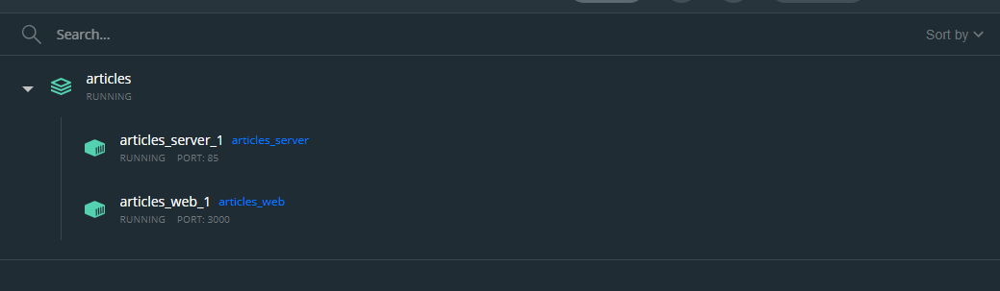
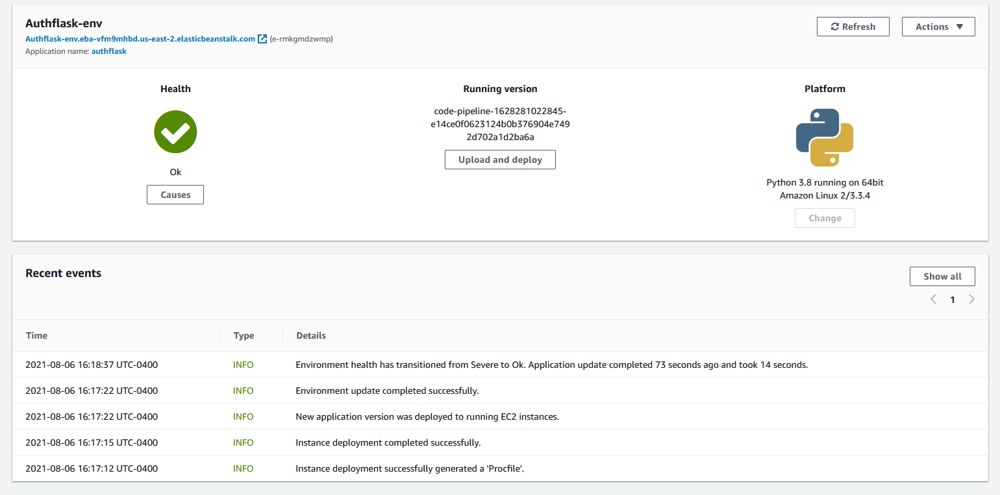
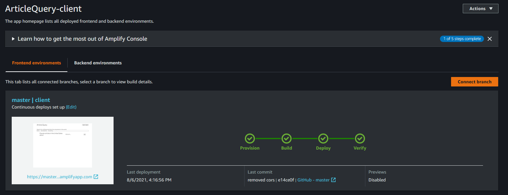
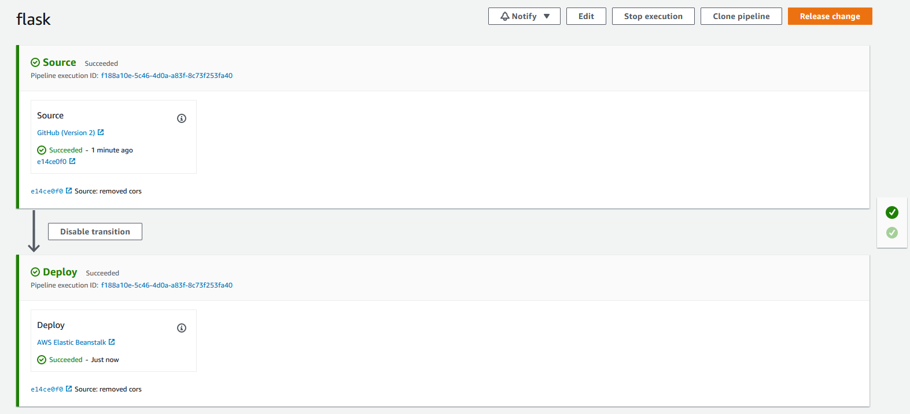

# articlequery
Flask authoriztion is in application.py and the src folder is the client side. The screenshots below show the AWS and Docker developments. Unfortunately I had to stop paying for AWS.

## Docker container with client and server Docker images

## Elastic Beanstalk server

## Amplify client side

## Code Pipeline for continous deployment

